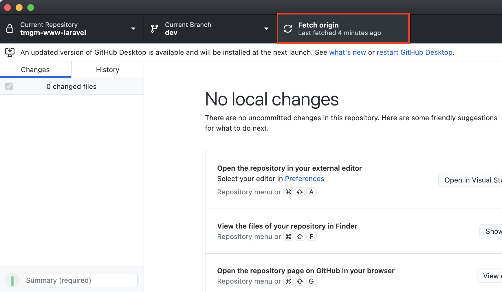
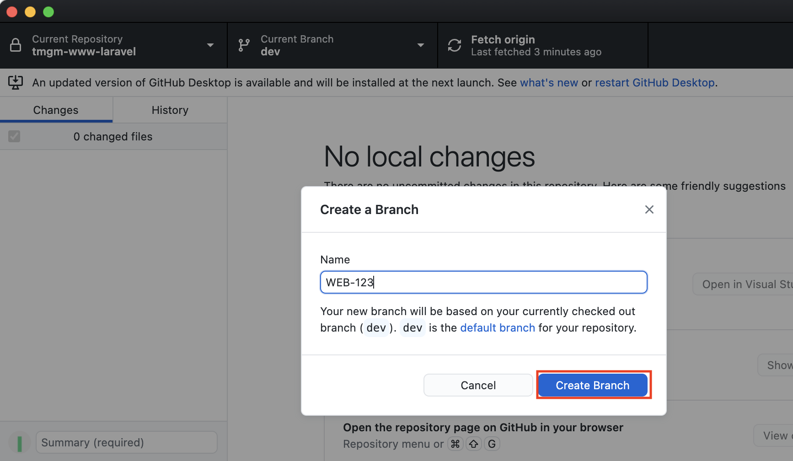
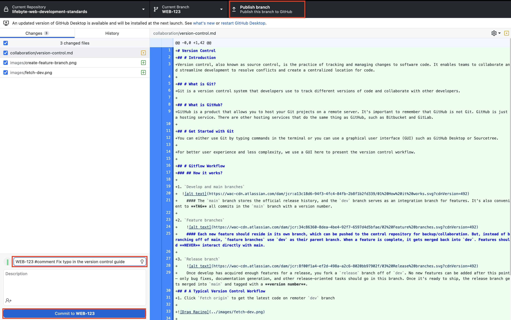

# Version Control
## # Introduction
Version control, also known as source control, is the practice of tracking and managing changes to software code. It enables teams to collaborate and streamline development to resolve conflicts and create a centralized location for code.

## # What is Git?
Git is a version control system that developers use to track different versions of code and collaborate with other developers.

## # What is GitHub?
GitHub is a product that allows you to host your Git projects on a remote server. It's important to remember that GitHub is not Git. GitHub is just a hosting service. There are other hosting services that do the same thing as GitHub, such as Bitbucket and GitLab.

## # Get Started with Git
You can either use Git by typing commands in the terminal or you can use a graphical user interface (GUI) such as GitHub Desktop or Sourcetree.

For better user experience and less complexity, we use a GUI here to present the version control workflow. 

## # Gitflow Workflow
### ## How it works?

1. `dev` and `main` branches
  
    #### The `main` branch stores the official release history, and the `dev` branch serves as an integration branch for features. It's also convenient to **TAG** all commits in the `main` branch with a version number.
  
2. `Feature branches`
    
    #### Each new feature should reside in its own branch, which can be pushed to the central repository for backup/collaboration. But, instead of branching off of `main`, `feature` branches use `dev` as their parent branch. When a feature is complete, it gets merged back into `dev`. Features should **NEVER** interact directly with `main`.

3. `Release branch`
    
    Once develop has acquired enough features for a release, you fork a `release` branch off of `dev`. **NO** new features can be added after this point — only bug fixes, documentation generation, and other release-oriented tasks should go in this branch. Once it's ready to ship, the release branch gets merged into `main` and tagged with a **version number**. In addition, it should be merged back into `dev`. Then, the `release` branch will be deleted
## # A Typical Version Control Workflow
1. Click `Fetch origin` to get the latest code on remote `dev` branch

    

2. Create a new `feature` branch based on the `dev` branch, the name of the `feature` branch should be the same as the **ticket**.

    

3. After completing the `feature` branch, you need to commit the code with a **commit message** and publish the `feature` branch
    

To write good commit messages, following rules below:
#### Commit messages standard: 
```html
WEB-XXX #comment <type>(<scope>): <subject>
 ```
 - **type(required)**
    #### Specify the type of commit:
    
    - **feat**: The new feature you're adding to a particular application
    - **fix**: A bug fix
    - **style**: Feature and updates related to styling
    - **refactor**: Refactoring a specific section of the codebase
    - **perf**: Everything related to optimisation, like performance and user experience
    - **test**: Everything related to testing
    - **docs**: Everything related to documentation
    - **chore**: Regular code maintenance.
    - **merge**: Merge code
    - **revert**: Revert to the previous version

- **scope(optional)**
    The scope is used to describe the scope of the impact of the commit, i.e. controller, view or database

- **subject(required)**
    Using a single short line (less than **50** character) to summarize the change

    > Learn more about git commit at [Git commit](https://cbea.ms/git-commit/)

4. If you need to do any updates on the `feature` branch, remember to fetch the code from remote `dev` branch and merge the latest code to the `feature` branch
5. After passing the test, merge the `feature` branch to `dev` and delete the `feature` branch
6. When it is ready to release, please read [Release plan](../deployment/release-plan.md)

> Learn more about Git at: [Learn Git](https://www.atlassian.com/git/tutorials/setting-up-a-repository)

