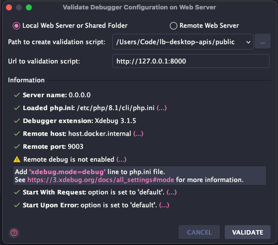

# IDE Settings Guide

## # PhpStorm

### ## Laravel Plugins

Before you start working with Laravel, make sure that either of the following plugins are installed and enabled:

- [Laravel Idea](https://laravel-idea.com/docs/install) (paid) plugin.
- [Laravel](https://plugins.jetbrains.com/plugin/7532-laravel/) plugin (free)
  and [Laravel IDE helper](https://github.com/barryvdh/laravel-ide-helper) tool. (See how to
  at [PHPStorm documentation](https://www.jetbrains.com/help/phpstorm/laravel.html))

#### ### Install Laravel Idea plugin (Recommended)

See [Laravel Idea documentation](https://laravel-idea.com/docs/install)

#### ### Install Laravel plugin & Laravel IDE helper (Free)

Install and enable _Laravel_ plugin in **_Settings > Languages & Frameworks > PHP > Laravel_**
Install _Laravel IDE helper_:

```shell
composer require --dev barryvdh/laravel-ide-helper
```

Add _Laravel IDE helper_ as a ServiceProvider into the application. In the `config/app.php` file,
add `Barryvdh\LaravelIdeHelper\IdeHelperServiceProvider::class` under the `providers` element:

```php
return array(
    //...
    'providers' => array(
        // ...
        // Laravel IDE helper
        'Barryvdh\LaravelIdeHelper\IdeHelperServiceProvider::class',
    ),
    // ...
);
```

Update composer scripts in `composer.json` to enable automation:

```json lines
{
    // ...
    "scripts": {
        "post-update-cmd": [
            // ...
            "@ide-helper"
        ],
        // ...
        "ide-helper": [
            "@php artisan ide-helper:generate",
            "@php artisan ide-helper:meta",
            "@php artisan ide-helper:models -N"
        ]
    }
}
// ...
```

> The Laravel IDE Helper may have to be run (`composer run ide-helper`) after changing or adding services, controllers,
> models and views.

### ## PHP CLI Interpreter

1. Go to `Preferences > PHP`
2. Click `...` at `CLI interpreter`
3. Click `+`, select `From Docker, Vagrant, VM and Remote host`
4. Select `Docker` in the popup dialog, select `sail-8.1/app:latest` in `Image name` dropdown. Check PHP general
   information at `General` section and click OK

### ## Debugging With Xdebug

1. Add `SAIL_XDEBUG_MODE=develop,debug,coverage` to `.env` file to configure Xdebug
2. Restart Sail:

    ```shell
    sail up -d
    ```
   
3. Go to `Preferences > Debug`, click `validate`
4. Select `Local Web Server and Shared Folder`
5. Set `Path to create validation script` to `[your-project-root-path]/public`
6. Set `Url to validation script` to `http://127.0.0.1` (add port if `APP_URL` env is set, e.g. `http://127.0.0.1:8000`)
7. Run validation by clicking `Validate` button, than you will see this:

    

#### ### Debug on Chrome

Your Chrome browser should
install [Xdebug helper extension](https://chrome.google.com/webstore/detail/xdebug-helper/eadndfjplgieldjbigjakmdgkmoaaaoc)
in advance

1. Enable listening to incoming debugging connections: Toggle the `Start Listen for PHP Debug Connections` button on the PhpStorm toolbar
2. Set a breakpoint in your code
3. Active Xdebug helper in Chrome
4. Start the debugging session:
   1. Reload page in the browser and return to PhpStorm, In the` Incoming Connection From Xdebug` dialog, click Accept
   2. Go to `Preferences > PHP > Servers`, map directory `src` to the absolute path on server `/var/www/html`, then click OK
5. Now you are good to investigate the application.

> See more at: [Laravel documentation](https://laravel.com/docs/9.x/sail#debugging-with-xdebug).

#### ### Debug APIs with Postman

1. Do Xdebug settings above ([Debug on Chrome](#-debug-on-chrome))
2. Add a cookie in Postman: `XDEBUG_SESSION=PHPSTORM; Path=/;`, or you can add a URL query in your request URL: `XDEBUG_SESSION_START=PHPSTORM`
3. All done!

See more [here](https://lukashajdu.com/post/usign-xdebug-with-postman/)
